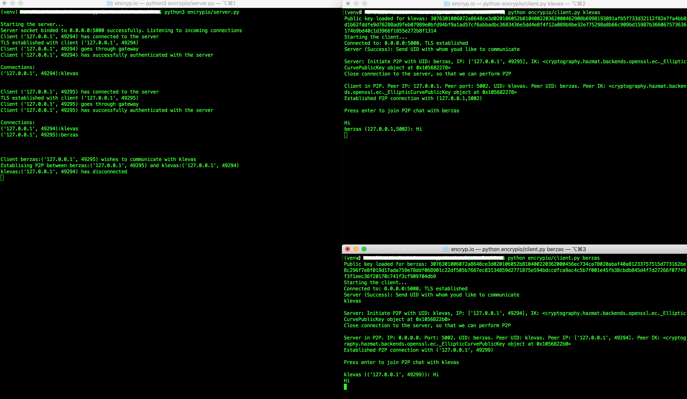
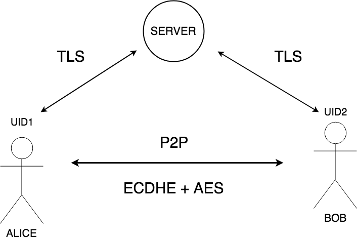

# encryp.io

<p align="center"></p>

Prototype of a *secure* real-time peer-to-peer encrypted communication network. Developed in a 36-hour period at a security hackathon.

## Table of Contents

- [Example](#Example)
- [Architecture](#Architecture)
- [Tech stack/protocols/ideas etc.](#Tech-stack/protocols/ideas-etc.)
- [Features](#Features)
- [Design](#Design)

## Example

Clone repo and get the requirements to your local virtual environment:

```
$ git clone https://github.com/KaroliShp/encryp.io.git
$ cd encryp.io
$ pip install -r requirements.txt
```

Start the server:

```
$ python encrypio/server.py
```

In separate terminals start two clients:

```
$ python encrypio/client.py klevas
$ python encrypio/client.py berzas
```

Then once the connection is established, just enter the other UID in one of the terminals (for example `klevas` in berzas terminal) and once you're connected, click enter.

Example connection screenshot:

<p align="center"></p>

## Architecture

A diagram of the architecture:

<p align="center"></p>

Each user has its own *UID* and *public and private key pair*.

End users (Alice and Bob) connects to the server and authenticates with it. Security is achieved by establishing a *TLS connection* (both server and client verification).

One of the end users (the initiator) then asks to establish a connection with the other user(s). After the user(s) has accepted the incomming connection request, the server shares relevant public keys and UIDs with relevant parties. *P2P connection* is then established between the parties.

P2P is secured using *ECDH key exchange* (with key size of 384 bits). *AES* keys of 256 bits size are used thereafter to encrypt the communications. *Forward secrecy* is achieved by using unique symmetric key for each message that gets sent - this gives assurances your session keys will not be compromised even if one of the private keys is compromised

## Tech stack/protocols/ideas etc.

* Python (sockets, SSL, cryptography libraries)
* Public key infrastucre (kind of)
* Cryptography (symmetric ciphers, key-agreement protocols)
* Network (communication via TCP-based sockets)

## Features

* Online-only messaging (theoretically the client could locally hold a limited number of messages for the other party until the other party becomes available)

* No chat history, thus messages are *NEVER* stored on any server (timer for messages to be deleted by the clients)

## Design

Some neat design solutions from one of the h4x0rz (gifs)

<p align="center"></p>

<p align="center"></p>